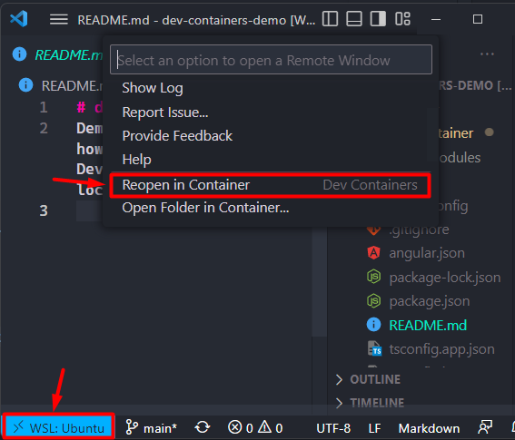
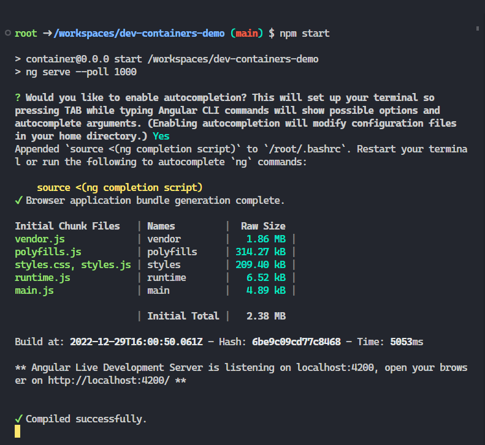

# dev-containers-demo

## About
A [Development Container](https://containers.dev/overview) (or Dev Container for short) allows you to use a container as a fully-featured development environment. It can be used to run an application, separate tools, libraries, and runtimes needed for working with a codebase, as well as aiding in continuous integration and testing. Developers can run Dev Containers locally or remotely in a private or public cloud.

Examples of remote dev containers:
- [Github Codespaces](https://github.com/features/codespaces)
- [Gitpod](https://www.gitpod.io/)

## Purpose
Every developer in their career encountered the issue of dealing with different package versions, runtimes, tool setups, and differences in line endings due to OS configurations, to mention a few. A project can have the perfect README, bash setup, you name it, but there will always be an incorrect Node version in a developer's workstation :D.

To mitigate these problems, we introduce __Dev Containers__, a containerized development environment where the developer can focus on coding without the hustle of configuring the local environment.

Runtimes, IDE extensions, dev dependencies, and other stuff are configured in the containers.

The following section will show how to install this setup and run Dev Containers in your workstation.

## Prerequisites

- Docker: [Docker Desktop](https://docs.docker.com/desktop/install/windows-install/) or [Docker Engine(Linux)](https://docs.docker.com/engine/install/).
- SSH Keys: Configure ssh credentials to interact with the repository. 
    * [GitHub](https://docs.github.com/en/authentication/connecting-to-github-with-ssh/checking-for-existing-ssh-keys)
    * [GitLab](https://docs.gitlab.com/ee/user/ssh.html)
    * [Azure DevOps](https://learn.microsoft.com/en-us/azure/devops/repos/git/use-ssh-keys-to-authenticate?view=azure-devops)
- Dev containers: Visual Studio Code extension through [marketplace](https://marketplace.visualstudio.com/items?itemName=ms-vscode-remote.remote-containers)

---
### Windows
We found that Dev Containers have certain performance issues in Windows because of the filesystem. There are a few ways to [improve the performance](https://code.visualstudio.com/remote/advancedcontainers/improve-performance), but the one that worked the best for us is using the [Windows Subsystem for Linux (WSL)](https://learn.microsoft.com/en-us/windows/wsl/about).

#### Requirements
Apart from the prerequisites above, you'll need to set up a few more tools in Windows:

- **WSL2**: [Install the WSL2](https://learn.microsoft.com/en-us/windows/wsl/install).
- **Linux distro**: A Linux-based distribution is required. [Ubuntu](https://www.microsoft.com/store/productId/9PDXGNCFSCZV) is the recommended distro.
- **WSL**: Visual Studio Code extension through [marketplace](https://marketplace.visualstudio.com/items?itemName=ms-vscode-remote.remote-wsl)
- **SSH Keys**: It's important to mention that the SSH setup must be done in WSL(using the terminal provided by the installed distro). 

#### Before you start
Given that WSL2 performs better while sharing data with the containers, we **strongly recommend** using the file system allocated in WSL.

To accomplish this, use Windows explorer under the Linux folder (not `C:\\` disk) or use a bash (not `cmd` or `ps`) terminal to navigate the WSL file system.

It's essential to clone (or move) the repositories into the WSL file system.

---
### MacOS
#### Requirements
Apart from the prerequisites above, you might need to configure a few more things for Mac:

- **Docker desktop permissions**: Allow MacOS to share folders/data with Docker Desktop application. Check [here](https://stackoverflow.com/a/58482702) how to do it.

---
## Steps to run your code in a container

Working with Dev Containers is pretty straight forward. Here's a quick guide for how to work in the container.

1. Open the project in VS Code.
> :warning: Windows users, if while opening the project you see the message: *"When working on folders in we recommend to use a WSL window. In a WSL window, all commands, extensions and the terminal run in the Linux subsystem. To switch to a WSL window, use Reopen Folder in WSL."* Select __Reopen Folder in WSL__ option.

2. Select the Remote Window option (left button in bottom bar) or press __F1__ to open the action bar, and select the option called __Reopen in Container__ inside of *Dev Container* section group.
> :information_source: The container will start-up and install all the needed dependencies to have a fully-working environment for the project.

3. Now, just start your project executing the start-up command (i.e: `yarn start`) in a terminal inside of the container, using the opened VS Code terminal (recommend) or using an external terminal via `Docker exec` command.
> :information_source: If the tech stack of the project support hot reloading, you must be able to visualize the changes live.

4. To commit and push changes to the repo, you can use either the terminal (inside or outside of the container) or the *Source Control* built-in functionality of VS Code.
